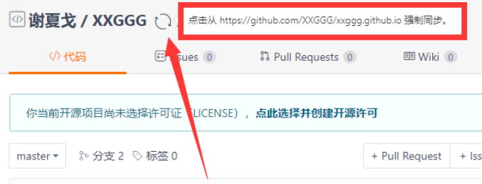
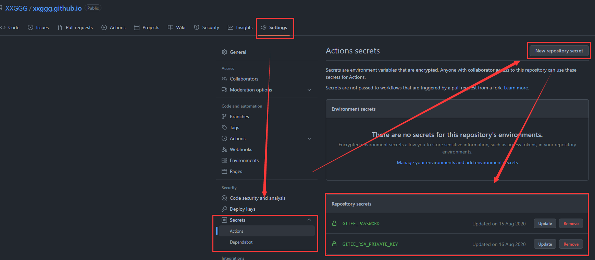

## 🟥🟧🟨🟩🟦🟪🟫⬛⬜
## 🟥 前言 

>[参考文章1：https://www.imooc.com/article/302662](https://www.imooc.com/article/302662)    
[参考文章2：https://github.com/marketplace/actions/gitee-pages-action](https://github.com/marketplace/actions/gitee-pages-action)  

因为国内无法访问到GitHub Pages的原因（偶尔会访问不到，特别是之前一段时间）。

- 【问题】我想同时更新两个仓库,也就是两个博客（github pages、gitee pages）

- 【方法1】之前用的方法是 一个本地仓库绑定两个远程仓库（GitHub和Gitee）【但不是很好的解决这个问题】  
- 【方法2】我把GitHub仓库 同步到了 码云-Gitee  并且启用 Gitee Pages

## 🟧【方法1】
【分支-源文件】-> 【Actions自动部署/自动打包】->【把打包好的dist部署到主分支master】
1. GitHub只push副分支，Actions有帮我打包更新到master主分支，
2. Gitee也只push副分支，Gitee码云没有更新master主分支

这就导致我xxggg.github.io这个博客有更新，而xxggg.gitee.io这个博客没有更新。


**一：在我的Gitee项目里按一下强制同步那个按钮（但是这。。。）**  
  

**二：不用主副分支，分两个仓库，一个源代码，一个打包后的代码。（但是这样每次都要手动打包 还要push两次)**     
**三：也就是今天要讲的！👇 用GitHub Actions把代码同步到Gitee**


## 🟨【方法2】

在项目根目录下创建 `.github/workflows/` 在这个文件夹里再创建`vuepress-deploy.yml`文件  
  

-  GitHub 的Actions会处理`.github`下的工作流文件夹`workflows` 
```yml
name: Sync

on: [ psuh ]

jobs:
    build:
        runs-on: ubuntu-latest
        steps:
        - name: Sync to Gitee
            uses: wearerequired/git-mirror-action@master
            env:
                # 注意在 Settings->Secrets 配置 GITEE_RSA_PRIVATE_KEY
                SSH_PRIVATE_KEY: ${{ secrets.GITEE_RSA_PRIVATE_KEY }}
            with:
                # 注意替换为你的 GitHub 源仓库地址
                source-repo: "git@github.com:XXGGG/xxggg.github.io.git"
                # 注意替换为你的 Gitee 目标仓库地址
                destination-repo: "git@gitee.com:XXGGG/XXGGG.git"

        - name: Build Gitee Pages
            uses: yanglbme/gitee-pages-action@master
            with:
                # 注意替换为你的 Gitee 用户名
                gitee-username: XXGGG
                # 注意在 Settings->Secrets 配置 GITEE_PASSWORD
                gitee-password: ${{ secrets.GITEE_PASSWORD }}
                # 注意替换为你的 Gitee 仓库
                gitee-repo: XXGGG/XXGGG
```
除了简单更换填写你的github跟gitee对应项目地址以外  
最重要的的就是配置好你GitHub项目里的`settings` ->`secrets`  里的`GITEE_RSA_PRIVATE_KEY`  和 `GITEE_PASSWORD` 

- `GITEE_RSA_PRIVATE_KEY` 是你的私钥
- `GITEE_PASSWORD` 是你Gitee的账户密码

  


## 🟩 如何得到私钥公钥

[我的笔记: 🗝️SSH - 公钥 私钥](https://xxggg.github.io/docs/note/config/SSH-%E5%85%AC%E9%92%A5%E7%A7%81%E9%92%A5.html)
>参考文章：  
[https://blog.csdn.net/fenghuibian/article/details/73350890](https://blog.csdn.net/fenghuibian/article/details/73350890)    
[https://gitee.com/help/articles/4181#article-header0](https://gitee.com/help/articles/4181#article-header0)  

### 🟩 第一步 生成SSH Key
打开终端 或者是Git Bash (windows下载git后自带的)
    
    ssh-keygen -t rsa -C "xxxx@xxxx.com"
    //(xxxx@xxxx.com 为你的邮箱)

按照提示完成三次回车，即可生成 ssh key。  
通过查看 `~/.ssh/id_rsa.pub` 文件内容，获取到你的公钥

    cat ~/.ssh/id_rsa.pub

然后出来的一大串东西都是公钥。

### 🟩 第二步 把公钥添加到github 和 gitee
去浏览器登上你的GitHub然后在<code>settings</code>-><code>SSH and GPG keys</code>里添加上公钥（码云gitee同理）

### 🟩 第三步 测试是否配置成功 ssh -T git@github.com

打开终端，测试github用

    ssh -T git@github.com

测试itee用

    ssh -T git@gitee.com

若返回 Hi XXX! You've successfully authenticated, but (Gitee.com/GitHub.com) does not provide shell access. 内容，则证明添加成功。

## 🟦 填上刚刚需要的私钥

在 ~/.ssh目录下有id_rsa 和id_rsa.pub两个文件  
id_rsa.pub是公钥  
id_rsa 是私钥

    cat ~/.ssh/id_rsa

查看私钥 然后把私钥添加到GitHub项目里的<code>settings</code>-><code>secrets</code> 里的<code>GITEE_RSA_PRIVATE_KEY</code>

>**注意 全都要复制 别漏了 开头和结尾也要复制进**

## 🟢🟡🔴

这就可以啦 每次push都会把GitHub的整个仓库（包括分支的内容） 强制同步到Gitee上 

>**上面只是在你把本地仓库push到github的时候自动帮你把github仓库拉到gitee上。如果你是写博客，想让博客项目自动打包再自动同步，那就要在这同步仓库之前，设置自动打包。（下面附上自动打包且自动同步的文件配置👇**

```yml
name: Build and Deploy
on: [push]

# 任务
jobs:
  build-and-deploy:
    # 服务器环境：最新版 Ubuntu
    runs-on: ubuntu-latest
    steps:
      # 拉取代码
      - name: Checkout
        uses: actions/checkout@v2
        with:
          persist-credentials: false

      # 生成静态文件
      - name: Build
        run: npm install && npm run build

      # 部署到 GitHub Pages
      - name: Deploy
        uses: JamesIves/github-pages-deploy-action@releases/v3
        with:
          GITHUB_TOKEN: ${{ secrets.GITHUB_TOKEN }}
          BRANCH: master
          FOLDER: public

# 接下来的操作是把github的代码 同步到 码云上 gitee 实现gitee pages的伪自动部署

      - name: Sync to Gitee
        uses: wearerequired/git-mirror-action@master
        env:
          # 注意在 Settings->Secrets 配置 GITEE_RSA_PRIVATE_KEY
          SSH_PRIVATE_KEY: ${{ secrets.GITEE_RSA_PRIVATE_KEY }}
        with:
          # 注意替换为你的 GitHub 源仓库地址
          source-repo: "git@github.com:XXGGG/xxggg.github.io.git"
          # 注意替换为你的 Gitee 目标仓库地址
          destination-repo: "git@gitee.com:XXGGG/XXGGG.git"

      - name: Build Gitee Pages
        uses: yanglbme/gitee-pages-action@master
        with:
          # 注意替换为你的 Gitee 用户名
          gitee-username: XXGGG
          # 注意在 Settings->Secrets 配置 GITEE_PASSWORD
          gitee-password: ${{ secrets.GITEE_PASSWORD }}
          # 注意替换为你的 Gitee 仓库
          gitee-repo: XXGGG/XXGGG
```
主要上面要更换一下你的BRANCH（现在的github有可能变成main了） 还有打包（FOLDER: public）

对于Gitee Pages前提是你已经开启Gitee Pages哦 首次同步要去开一下Gitee Pages


