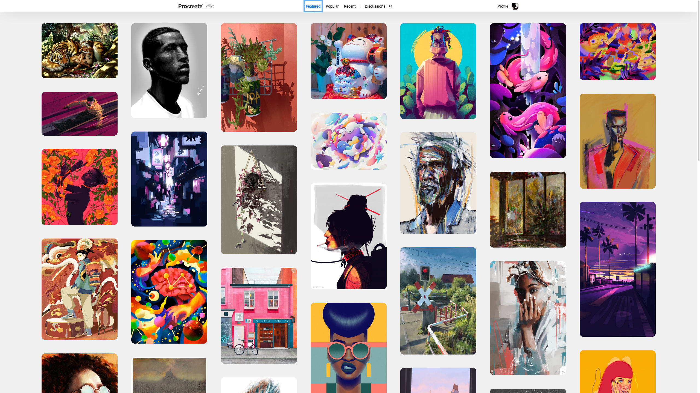
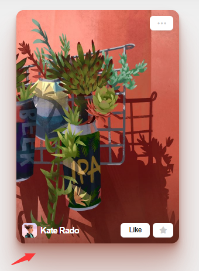
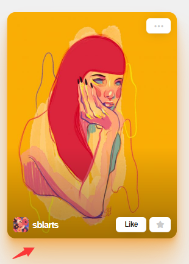
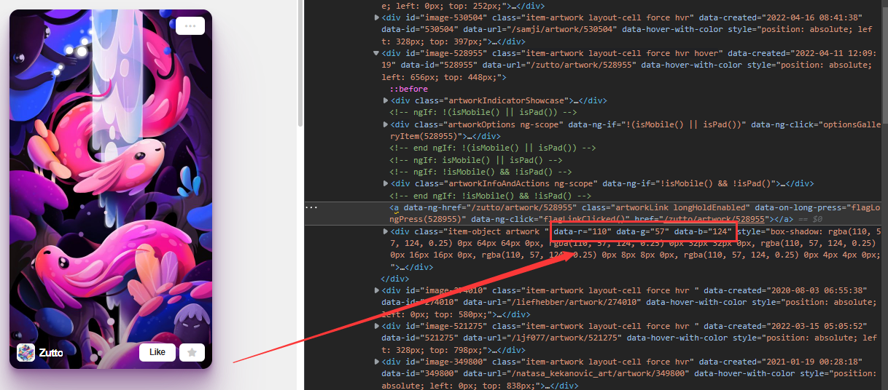
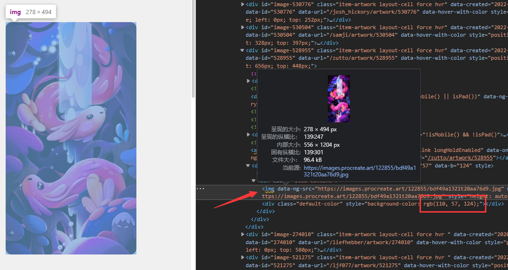
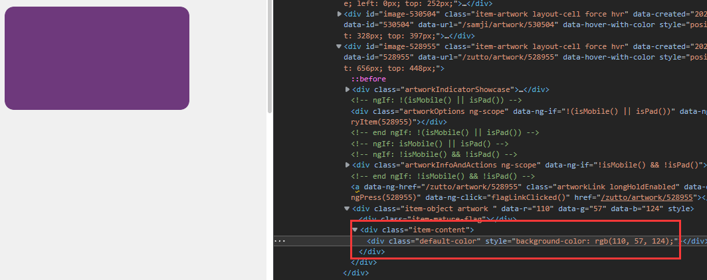
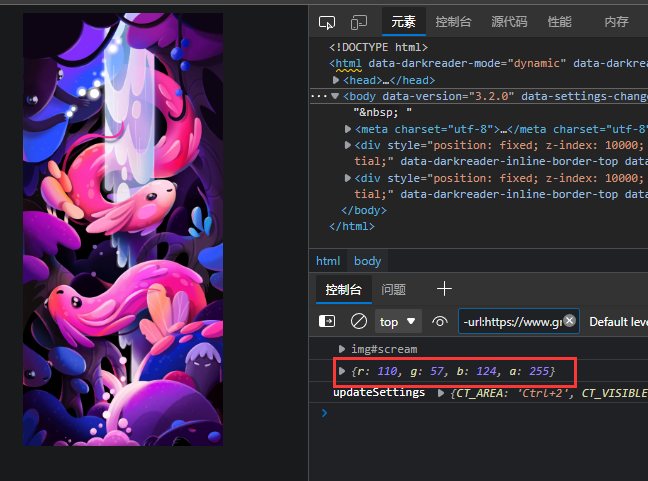

## 🟥🟧🟨🟩🟦🟪🟫⬛⬜


## 🟥 前言！

最近！（其实也不是最近了，之前也...）  
我看了Procreate的官方画展网站：[https://folio.procreate.art/showcase](https://folio.procreate.art/showcase)
> Procreate是一款ipad的绘画软件

  

当我的鼠标 移动到图片上面去的时候，他会有一个图片浮空的阴影！   

  


其实制作图片阴影是非常简单的，css3里面就有一个`box-shadow`

但是这里的关键是！他会根据图片里的一个【整体颜色】来做阴影。

这样每张图片的阴影就会显得非常好看了！  

红色的图片红色的阴影，黄色的图片黄色的阴影！非常有立体感！非常美！

### 🟥 那么问题就来了！  
1. 如何获取图片的颜色
2. 如何根据图片的颜色计算出一个综合颜色

## 🟧 HMTL5里canvas的getImageData

> canvas教程：[https://www.runoob.com/html/html5-canvas.html](https://www.runoob.com/html/html5-canvas.html)    
  
canvas的getImageDate可以得到canvas画布里每个像素点的颜色！    

1. 把图片丢进canvas的画布里
2. 用canvas的getImageDate属性获得画布每个像素点的信息集
3. 根据信息集做遍历，计算rgba里每一个值的平均值，以此获得一个综合颜色！


```html

<canvas id="myCanvas" width="200" height="300" style="border:1px solid #c3c3c3;"></canvas> 
```
```js
var img = document.getElementById("scream"); //图片节点
var c = document.getElementById("myCanvas");  //canvas元素

function rgba() {
    c.width = img.width
    c.height = img.height
    var ctx = c.getContext("2d"); 
    //getContext("2d") 对象是内建的 HTML5 对象，
    //拥有多种绘制路径、矩形、圆形、字符以及添加图像的方法。
    
    ctx.drawImage(img, 0, 0, c.width, c.height); 
    //把图片画入画布(图片节点，左上角开始的x,y, 画入图片的宽，高)

    var imgData = ctx.getImageData(0, 0, c.width, c.height);
     //getImageDate 得到画布里的图片信息(画布的四个角)

    // console.log(imgData) //看一下取出来的数据对象！

    // 取所有像素的平均值
    let r = 0;
    let g = 0;
    let b = 0;
    let a = 0;
    for (let row = 0; row < c.height; row++) {
        for (let col = 0; col < c.width; col++) {
            r += imgData.data[((c.width * row) + col) * 4];
            g += imgData.data[((c.width * row) + col) * 4 + 1];
            b += imgData.data[((c.width * row) + col) * 4 + 2];
            a += imgData.data[((c.width * row) + col) * 4 + 3];
        }
    }

    // 求取平均值
    r /= (c.width * c.height);
    g /= (c.width * c.height);
    b /= (c.width * c.height);
    a /= (c.width * c.height);

    // 将最终的值取整
    r = Math.round(r);
    g = Math.round(g);
    b = Math.round(b);
    a = Math.round(a);

    let rgba = {
        r,
        g,
        b,
        a,
    }
    console.log(rgba)
    return rgba
}
```
### 🟧 首先！这是网站的👇



把图片标签删掉，下面有一个底
  

可以看到rgb是(110,57,124)

### 🟧 这是我们写所得的👇
  
获得的rgb也是(110,57,124)

**成功！**
## 🎊🍾🥳🎉

当然这就是这篇文章的主要解决的问题了  
【获得图片的主体颜色】  

后面我自己还想把这种方法封装起来，或者制作一个vue的ui组件。这些就留给下一篇文章吧~


对了 网上还有别的计算【主体颜色】的方式！大家可以继续自行搜索。