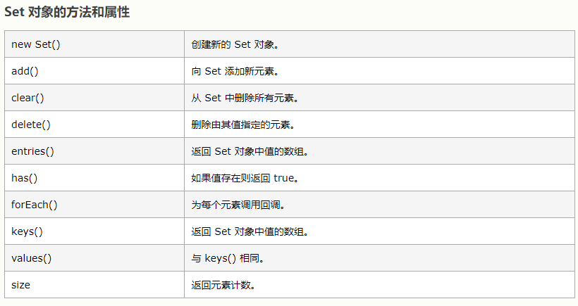

# 🟢 map

```
var m = new Map([['Michael', 95], ['Bob', 75], ['Tracy', 85]]);
m.get('Michael');           // 95

var m = new Map();          // 空Map
m.set('Adam', 67);          // 添加新的key-value
m.set('Bob', 59);
m.has('Adam');              // 是否存在key 'Adam': true
m.get('Adam');              // 67
m.delete('Adam');           // 删除key 'Adam'
m.get('Adam');              // undefined
```

# 🟢 set

'Set'和'Map'类似，也是一组key的集合，但不存储value。由于key不能重复，所以，在Set中，没有重复的key。
要创建一个Set，需要提供一个Array作为输入，或者直接创建一个空Set：
通过add(key)方法可以添加元素到Set中，可以重复添加，但不会有效果：

```javascript
s.add(4);
s;                  // Set {1, 2, 3, 4}
s.add(4);
s;                  // 仍然是 Set {1, 2, 3, 4}
通过delete(key)方法可以删除元素：

var s = new Set([1, 2, 3]);
s;                  // Set {1, 2, 3}
s.delete(3);
s;                  // Set {1, 2}
```
## 把【set】转成【数组】、 把【数组】转成【set】
```javascript
const nums = [1,2,3,4,3,2,1]

uniq1 = [...new Set(nums)]

uniq2 = Array.from(new Set(nums))
```
  

