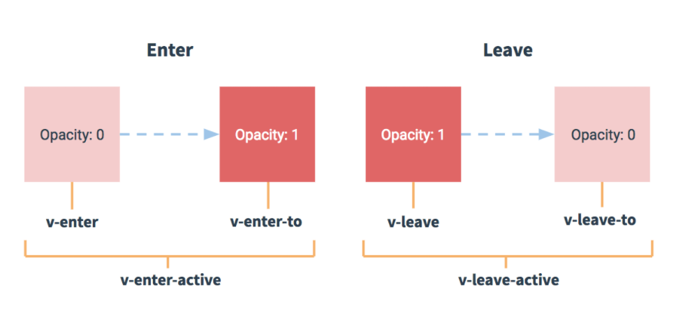
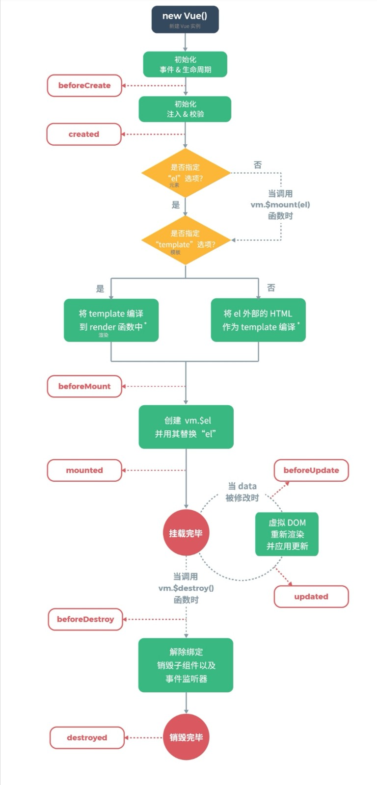

参考文章：[http://www.imooc.com/wiki/vuelesson/vueinstall.html](http://www.imooc.com/wiki/vuelesson/vueinstall.html)  
## 🟢 安装

1. 先安装node
```shell
# 创建项目目录
$ mkdir demo

# 进入项目文件夹
$ cd demo
$ npm init -y

# 最新稳定版
$ npm install vue

# 安装指定版本Vue
$ npm install vue@2.6.3
```
> 这里安装的 vue 不是 vue-cli 脚手架

## 🟢 实例
```javascript
var vm = new Vue({
  el: "#app",
  data() {
    return {
      message: 'Hello Imooc !'
    }
  }
})


////////////////////////////
var vm = new Vue({
  el: "#app",
  data() {
    return {
      message: {}
    }
  }
})
//使用 vm.$set 方法修改数据
vm.$set(vm.message, 'title','Hello Imooc !')
// 页面正确显示 Hello Imooc ! 
```
## 🟢 常用指令

1. v-text 【文本属性】
1. v-html 
1. v-bind （简写：“:”）【绑定】
1. v-for
1. v-if、v-else-if、v-else
1. v-show
1. v-on（简写：“@”）【触发事件】
1. v-model 【双向绑定】
1. v-pre【该指令会跳过所在元素和它的子元素的编译过程】【比如{{age}} 里面的age不会生效， {{}}也不会被转义】
1. v-once【模板只会在第一次更新时显示数据，此后再次更新该 DOM 里面引用的数据时，内容不会自动更新。】
## 🟢 动态数据绑定：略
## 🟢 计算属性：
参考：[http://www.imooc.com/wiki/vuelesson/vuecomputed.html](http://www.imooc.com/wiki/vuelesson/vuecomputed.html)
> 计算属性，就是当其依赖属性的值发生变化时，这个属性的值会自动更新，与之相关的 DOM 部分也会同步自动更新。— 官方定义

```javascript
 var vm = new Vue({
	el: '#app',
  data: {
  	count: 10,
  	unitPrice: 24
  },
  computed: {
  	totalPrice() {
  		return this.count * this.unitPrice
  	}
  }
})
```
```javascript
computed: {
  fullName: {
    // getter
    get: function () {
      return this.firstName + ' ' + this.lastName
    },
    // setter
    set: function (newValue) {
      var names = newValue.split(' ')
      this.firstName = names[0]
      this.lastName = names[names.length - 1]
    }
  }
}
```
第 4-6行，setter: 每次修改 fullName 时将姓赋值给 firstName，将名赋值给 lastName。
第 8-11行，getter: 每次获取 fullName 时将 firstName 和 lastName 拼接后返回。

## 🟢 监听器/侦听器 watch
> Vue 提供了一种更通用的方式来观察和响应 Vue 实例上的数据变动：侦听属性。 — 官方定义

```javascript
var vm = new Vue({
  el: '#app',
  data() {
    return {
      count: 0
    }
  },
  watch: {
    count: function(newVal, oldVal) {
      // 具体处理逻辑
    },
  }
})
```
```javascript
<body>
  <div id="app">
    <div>商品名称：<input v-model="product.name"/></div>
  </div>
</body>
<script src="https://unpkg.com/vue/dist/vue.js"></script>
<script>
  var vm = new Vue({
    el: '#app',
    data: {
      product: {
        name: ''
      }
    },
    watch: {
      'product.name': function(newValue){
        console.log(newValue)
      }
    }
  })
</script>
```
### 🔵 handler
我们给 name 绑定了一个 handler 方法，之前我们写的 watch 方法其实默认写的就是这个handler。当 name 发生改变时, handler 方法就会执行。
```javascript
var vm = new Vue({
  el: '#app',
  data: {
    name: '方便面'
  },
  watch: {
    name: {
      handler(newVal, oldVal) {
        console.log(newVal)
      }
    }
  }
})
```
### 🔵 immediate属性（立马执行一次先）
```javascript
var vm = new Vue({
  el: '#app',
  data: {
    name: '方便面'
  },
  watch: {
    name: {
      handler(newVal, oldVal) {
        console.log(newVal)
      },
      // 代表在wacth里声明了name这个方法之后立即先去执行一次handler方法
      immediate: true
    }
  }
})
```
### 🔵 deep属性（深度监听，监听对象里面的属性）
```javascript
var vm = new Vue({
  el: '#app',
  data: {
    product: {
      name: '',
      count: '',
      title: ''
    }
  },
  watch: {
    'product.name': function(newValue){
      console.log(newValue)
    },
    'product.count': function(newValue){
      console.log(newValue)
    },
    'product.title': function(newValue){
      console.log(newValue)
    }
  }
})
```
deep 属性代表是否深度监听，默认值是 false。当设置为 true 时，会对对象里面的每个属性进行侦听。
```javascript
var vm = new Vue({
  el: '#app',
  data: {
    product: {
      name: '',
      count: '',
      title: ''
    }
  },
  watch: {
    product: {
      handler: function(newVal) {
        console.log(newVal)
      },
      deep: true
    }
  }
})
```
## 🟢 事件处理 v-on/methods：
### 🟢 基本使用：略
### 🔵 获取原生 DOM 事件：$event
有时我们需要在内联语句处理器中访问原始的 DOM 事件。可以用特殊变量 $event 把它传入方法：
```javascript

<div id="app">
  <div>商品数量 {{count}}</div>
  <button v-on:click="setCount(10, $event)"> 设置为 10 个 </button>
  <button v-on:click="setCount(0, $event)"> 设置为 0 个 </button>
</div>

var vm = new Vue({
  el: '#app',
  data: {
    count: 0
  },
  methods: {
    setCount(count, event) {
      this.count = count
      console.log(event)
    }
  }
})
```
### 🔵 事件修饰符
```javascript
<!-- 阻止单击事件继续传播 -->
<a v-on:click.stop="doThis"></a>

<!-- 提交事件不再重载页面 -->
<form v-on:submit.prevent="onSubmit"></form>

<!-- 修饰符可以串联 -->
<a v-on:click.stop.prevent="doThat"></a>

<!-- 添加事件监听器时使用事件捕获模式 -->
<!-- 即内部元素触发的事件先在此处理，然后才交由内部元素进行处理 -->
<div v-on:click.capture="doThis">...</div>

<!-- 只当在 event.target 是当前元素自身时触发处理函数 -->
<!-- 即事件不是从内部元素触发的 -->
<div v-on:click.self="doThat">...</div>

<!-- 点击事件将只会触发一次 -->
<a v-on:click.once="doThis"></a>
```
### 🔵 按键修饰符
```javascript
<!-- 只有在 `key` 是 `Enter` 时调用 `login()` -->
<input v-on:keyup.enter="login">

<!-- 也可以使用 keyCode -->
<input v-on:keyup.13="login">
```

1. .enter: 回车键；
1. .tab: TAB键；
1. .delete: 删除和退格键；
1. .esc: 只有在event.终止键；
1. .space: 删除键；
1. .up: 上方向键：
1. .down: 下方向键：
1. .left: 左方向键：
1. .right: 右方向键：

### 🔵 系统修饰键

1. .ctrl:
1. .alt:
1. .shift:
1. .meta:
> 注意：在 Mac 系统键盘上，meta 对应 command 键 (⌘)。在 Windows 系统键盘 meta 对应 Windows 徽标键 (⊞)。在 Sun 操作系统键盘上，meta 对应实心宝石键 (◆)。在其他特定键盘上，尤其在 MIT 和 Lisp 机器的键盘、以及其后继产品，比如 Knight 键盘、space-cadet 键盘，meta 被标记为“META”。在 Symbolics 键盘上，meta 被标记为“META”或者“Meta”。

```javascript
<!-- Alt + C -->
<input @keyup.alt.67="clear">

<!-- Ctrl + Click -->
<div @click.ctrl="doSomething">Do something</div>
```
## 🟢 Vue 过渡 & 动画
```html
<transition name="fade">
	<p v-show = "show" >hello !</p>
</transition>

<style>
.fade-enter-active, .fade-leave-active {
	transition: opacity 3s
}
.fade-enter, .fade-leave-to {
	opacity: 0
}
</style>
```

- v-enter：定义进入过渡的开始状态。在元素被插入之前生效，在元素被插入之后的下一帧移除；
- v-enter-active：定义进入过渡生效时的状态。在整个进入过渡的阶段中应用，在元素被插入之前生效，在过渡 / 动画完成之后移除。这个类可以被用来定义进入过渡的过程时间，延迟和曲线函数；
- v-enter-to: 定义进入过渡的结束状态。在元素被插入之后下一帧生效 (与此同时 v-enter 被移除)，在过渡 / 动画完成之后移除。
- v-leave: 定义离开过渡的开始状态。在离开过渡被触发时立刻生效，下一帧被移除；
- v-leave-active：定义离开过渡生效时的状态。在整个离开过渡的阶段中应用，在离开过渡被触发时立刻生效，在过渡 / 动画完成之后移除。这个类可以被用来定义离开过渡的过程时间，延迟和曲线函数；
- v-leave-to: 定义离开过渡的结束状态。在离开过渡被触发之后下一帧生效 (与此同时 v-leave 被删除)，在过渡 / 动画完成之后移除。

  


## 🟢 数据双向绑定 v-model
> 用 v-model 指令在表单 ```<input>```、```<textarea>``` 及 ```<select>``` 元素上创建双向数据绑定。它会根据控件类型自动选取正确的方法来更新元素。v-model 本质上不过是语法糖。它负责监听用户的输入事件以更新数据，并对一些极端场景进行一些特殊处理。— 官方定义

### 🟢 基本用法：略
### 🔵 修饰符
```html
<!-- 在“change”时而非“input”时更新 -->
<input v-model.lazy="msg" >

<!-- 转换为“数值”类型 -->
<input v-model.number="age" type="number">

<!-- 自动过滤用户输入的首尾空白字符 -->
<input v-model.trim="msg">
```
## 🟢 Vue 生命周期
  

- **beforeCreate（创建前）**
- **created（创建后）**
- **beforeMount (载入前)**
- **mounted（载入后）**
- **beforeUpdate（更新前）**
- **updated（更新后）**
- **beforeDestroy（销毁前）**
- **destroyed（销毁后）**
### 3.1 创建前（beforeCreate）
在实例初始化之后，此时的数据观察和事件机制都未形成，不能获得 DOM 节点。
### 3.2 创建后（created）
实例已经创建完成之后被调用。在这一步，实例已完成以下的配置：数据观测（data observer），属性和方法的运算， watch/event 事件回调。然而，挂载阶段还没开始。
### 3.3 载入前（beforeMount）
在挂载开始之前被调用：这个过程是在模版已经在内存中编译完成， render 函数首次被调用，此时完成了虚拟 DOM 的构建，但并未被渲染。
### 3.4 载入后（mounted）
这个过程在模版挂载之后被调用，页面完成渲染，所以在这之后，我们可以操作和访问 DOM 元素。
### 3.5 更新前（beforeUpdate）
当数据更新时调用，在这一阶段 DOM 会和更改过的内容同步。
### 3.6 更新后（updated）
由于数据更改导致的虚拟 DOM 重新渲染和打补丁，在这之后会调用该钩子。
当这个钩子被调用时，组件 DOM 已经更新，所以你现在可以执行依赖于 DOM 的操作。然而在大多数情况下，你应该避免在此期间更改状态，因为这可能会导致更新无限循环。
### 3.7 销毁前（beforeDestroy）
实例销毁之前调用。在这一步，实例仍然完全可用。
### 3.8 销毁后（destroyed）
Vue 实例销毁后调用。调用后，Vue 实例指示的所有东西都会解绑定，所有的事件监听器会被移除，所有的子实例也会被销毁。


## 🔵 Vue 插槽 <slot>

<slot>元素作为承载分发内容的出口，可以理解为一个占位符，或者说是子组件暴露的一个让父组件传入自定义内容的接口。插槽内可以包含任何模板代码，包括 HTML，甚至其他的组件。在工作中如果你的组件内的内容是可变的，这个时候我们可以考虑使用插槽

### 🔵 默认插槽的使用
```html
{
  components: {
    'MyConponent': {
      template: '<div><slot /></div>'
    }
  }
}
<my-conponent>这里是要显示的插槽内容！</my-conponent>
```
### 🔵 具名插槽的使用
```html
{
  components: {
    'MyConponent': {
      template: '<div><slot name="hello"/></div>'
    }
  }
}
<my-conponent>
  <template slot="hello"></template>
</my-conponent>
```
## 🟢 Vue 组件间通信
### 🟢 父 传 子
```html
// 在子组件内定义组件接收一个参数 name
{
  props: ['name']
}
// 父组件使用组件时传递参数 name
<child :name="name"></child>
```
```html
{
  props: {
    name: {
      type: String,
      default: '句号'
    }
  }
}
```
### 🟢 子 传 父
```html
// 子组件定义事件
this.$emit('事件名称', '传递的参数') //例： this.$emit('add', 111)

// 父组件监听事件的触发
<child  @事件名称="事件触发的方法"/>
```

## 🟢 缓存 keep-alive 
**使用了keep-alive的组件的页面会被缓存起来，不会被销毁，包括它里面的定时器。**

keep-alive 缓存的组件只有在初次渲染时才会被创建。所以，我们通过修改 currentView 切换组件时，组件的 beforeDestroy 事件不会触发。若该组件是第一次渲染，会触发 created 事件，当再次切换显示该组件时，created 事件不会再次触发。
```html
<keep-alive>
  <component :is="currentView"></component>
</keep-alive>
```
### 🔵 activated 和 deactivated 生命周期
activated 和 deactivated 和我们之前学习的生命周期函数一样，也是组件的生命周期函数。
不过， activated 和 deactivated 只在 <keep-alive> 内的所有嵌套组件中触发。

- activated：进入组件时触发。
- deactivated：退出组件时触发。
```html
activated() {
  console.log('组件A 被添加')
},
deactivated() {
  console.log('组件A 被移除')
}
```
> **TIPS：** 注意，activated 和 deactivated 这两个生命周期函数一定是要在使用了 keep-alive 组件后才会有的，否则不存在。

### 🔵 include 和 exclude
include 和 exclude 是 keep-alive 的两个属性，允许组件有条件地缓存。
include： 可以是字符串或正则表达式，用来表示只有名称匹配的组件会被缓存。
exclude： 可以是字符串或正则表达式，用来表示名称匹配的组件不会被缓存。
```html
<keep-alive include="ComponentA,ComponentB">
  <component :is="ComponentA"></component>
  <component :is="ComponentB"></component>
  <component :is="ComponentC"></component>
</keep-alive>
```
# 🔵 Vue 高级👇
## 🔵 Mixin
[http://www.imooc.com/wiki/vuelesson/vuemixins.html](http://www.imooc.com/wiki/vuelesson/vuemixins.html)
> 混入 (mixin) 提供了一种非常灵活的方式，来分发 Vue 组件中的可复用功能。一个混入对象可以包含任意组件选项。当组件使用混入对象时，所有混入对象的选项将被 “混合” 进入该组件本身的选项。 – 官方定义

### 🔵 定义一个 mixin
mixin 本质上就是一个 Object 对象，它和 vue 实例上的属性一致，包含 data、methods、computed、watch、生命周期函数等等：
```html
var myMixin = {
  data(){
    return {
      //...
    }
  },
  created() {
     //...
  },
  methods: {
    //...
  },
  computed() {
    // ...
  }
}
```
### 🔵 混入 mixin
想要混入定义好的 mixin，只需要通过组件的 mixins 属性传入想要混入的 mixin 数组即可：
```html
var vm = new Vue({
  el: '#app',
  mixins:[myMixin]
})
```

## 🟢 注册自定义指令
[http://www.imooc.com/wiki/vuelesson/vuecustomdirective.html](http://www.imooc.com/wiki/vuelesson/vuecustomdirective.html)
### 🟢 全局注册
我们可以通过调用 Vue.directive 的方式来定义全局指令， 它接收两个参数：1. 指令名，2. 指令的钩子函数对象。
命名：

- **短横线**：<my-directive>
- **驼峰式**：<MyDirective> 使用驼峰命名指令时，首字母最好以大写字母开头。
```html
// 注册
// 驼峰命名
Vue.directive('MyDirective', {/* */})
// 短横线命名
Vue.directive('my-directive', {/* */})

// 使用
<div v-my-directive></div>
```
```html
<input id="name" v-focus type="text"/>

Vue.directive('focus', {
  inserted(el) {
    el.focus()
  }
})
```
### 🟢 局部注册
```html
// 注册
// 短横线命名
{
  directives: {
      'my-directive': {
        inserted: function (el) {
          el.focus()
        }
      }
    }
}

// 使用
<div v-my-directive></div>
```
## 🟢 钩子函数

- bind：只调用一次，指令第一次绑定到元素时调用，在这里可以进行一次性的初始化设置；
- inserted：被绑定元素插入父节点时调用 （仅保证父节点存在，但不一定已被插入文档中）；
- update：所在组件的 VNode 更新时调用，**但是可能发生在其子 VNode 更新之前**。指令的值可能发生了改变，也可能没有。但是你可以通过比较更新前后的值来忽略不必要的模板更新 (详细的钩子函数参数见下)；
- componentUpdated：指令所在组件的 VNode **及其子 VNode** 全部更新后调用；
- unbind：只调用一次，指令与元素解绑时调用。
### 钩子函数参数

- el：指令所绑定的元素，可以用来直接操作 DOM ；
- binding：一个对象，包含以下属性：
   - name：指令名，不包括 v- 前缀；
   - value：指令的绑定值，例如：v-my-directive="1 + 1" 中，绑定值为 2；
   - oldValue：指令绑定的前一个值，仅在 update 和 componentUpdated 钩子中可用，无论值是否改变都可用；
   - expression：字符串形式的指令表达式，例如 v-my-directive="1 + 1" 中，表达式为 "1 + 1"；
   - arg：传给指令的参数，可选。例如 v-my-directive:foo 中，参数为 "foo"。
   - modifiers：一个包含修饰符的对象。例如：v-my-directive.foo.bar 中，修饰符对象为 { foo: true, bar: true }。
- vnode：Vue 编译生成的虚拟节点。移步 [VNode API](https://cn.vuejs.org/v2/api/#VNode-%E6%8E%A5%E5%8F%A3) 来了解更多详情；
- oldVnode：上一个虚拟节点，仅在 update 和 componentUpdated 钩子中可用。
### 动态指令参数


## 🟢 过滤器
```html
<!-- 在双花括号中 -->
{{ message | filteName }}

<!-- 在 `v-bind` 中 -->
<div v-bind:id="message | filteName"></div>


<!-- 全局 -->
Vue.filter('filteName', function(value) {
  if (!value) return ''
  value = value.toString()
  return value.charAt(0).toUpperCase() + value.slice(1)
})

<!-- 局部 -->
filters: {
  '过滤器名字': function(value) {
    // 具体过滤逻辑
  }
}

```
## 🟢 Vue 渲染函数
通常在一些简单的项目中不会使用，在处理一些复杂的业务场景时，使用渲染函数往往可以达到事半功倍的效果。
[http://www.imooc.com/wiki/vuelesson/vuerender.html](http://www.imooc.com/wiki/vuelesson/vuerender.html)
## 🟢 Vue 插件
插件通常用来为 Vue 添加全局功能。插件的功能范围没有严格的限制，一般有下面几种：

1. 添加全局方法或者属性。如: [vue-custom-element](https://github.com/karol-f/vue-custom-element)。
1. 添加全局资源：指令 / 过滤器 / 过渡等。如 [vue-touch](https://github.com/vuejs/vue-touch)。
1. 通过全局混入来添加一些组件选项。如 [vue-router](https://github.com/vuejs/vue-router)。
1. 添加 Vue 实例方法，通过把它们添加到 Vue.prototype 上实现。
1. 一个库，提供自己的 API，同时提供上面提到的一个或多个功能。如 [vue-router](https://github.com/vuejs/vue-router)。

